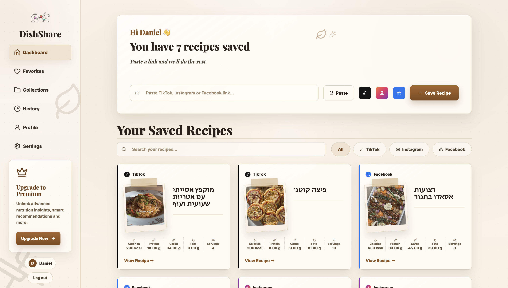
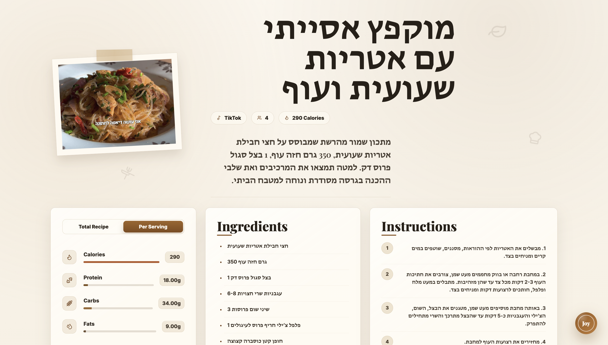
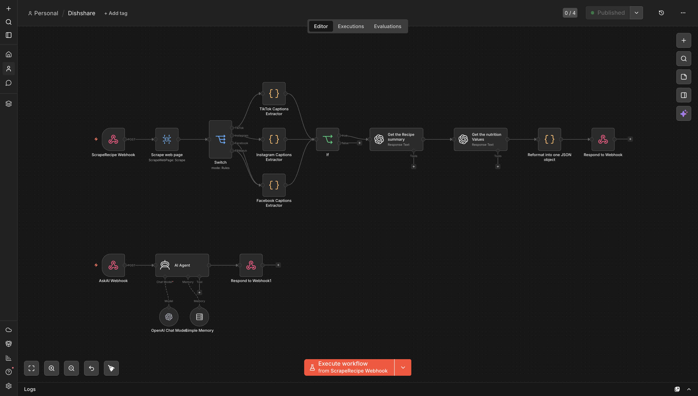

# Mibishel

> Save social recipe videos as a personal cookbook, then ask an AI assistant for recipe-specific help.

Mibishel is a full-stack recipe collection app built around a simple idea: paste a recipe link from TikTok, Instagram, or Facebook, let automation extract the useful cooking data, and keep the result in a clean private dashboard.

The project is split into a React/Vite frontend, an Express/TypeScript backend, a MySQL database layer, and n8n workflows that handle recipe scraping and AI responses.

---

## Screenshots

### Dashboard



The main dashboard gives each user a personal recipe collection. A single input bar accepts TikTok, Instagram, or Facebook links — paste a URL, hit **Save Recipe**, and the n8n scraping workflow handles the rest. Saved recipes appear as cards below, each showing the platform source, a polaroid-style thumbnail, and a quick nutrition summary (calories, protein, carbs, fats, servings). A sidebar provides navigation, a premium upgrade prompt, and quick access to the user account.

---

### Recipe Page



Opening a recipe card expands into a full detail view. The page shows the recipe title, platform badge, serving count, and total calories at a glance, followed by a short summary paragraph. Three panels below cover **nutrition** (with a toggle between total recipe and per-serving values and animated progress bars), **ingredients** as a clean bulleted list, and **instructions** as numbered steps. A floating **Joy** button in the bottom-right corner opens the AI assistant panel for recipe-specific questions.

---

### n8n Automation Workflow



The scraping and AI workflows live entirely in n8n. The recipe workflow starts at a **ScrapeRecipe Webhook**, passes the link to a web scraper, routes it through a platform switch (TikTok / Instagram / Facebook caption extractors), checks for valid output, then calls two AI steps in sequence — one to summarise the recipe and one to extract nutrition values — before reformatting everything into a single JSON object and returning it to the backend via **Respond to Webhook**. A separate, simpler workflow handles the **AskAI Webhook**: it receives the question and recipe context, passes both to an OpenAI chat model with simple memory, and responds directly.

---

## What It Does

- Saves recipes from social links.
- Supports TikTok, Instagram, and Facebook recipe sources.
- Extracts recipe title, ingredients, instructions, servings, thumbnail, calories, and macro nutrition.
- Stores every recipe per authenticated user.
- Provides login/register flows with JWT authentication.
- Shows a searchable, filterable recipe dashboard.
- Opens a detailed recipe page with nutrition tabs, ingredients, instructions, and the original video link.
- Includes Joy, an AI recipe assistant that answers questions using the saved recipe context.
- Uses n8n webhooks as the automation layer between the app and external scraping / AI workflows.

---

## Project Structure

```text
HeldyLady/
├── Backend/
│   ├── src/
│   │   ├── 2-utils/          # config, database access, crypto, n8n parsing
│   │   ├── 3-models/         # Joi-backed models and typed domain objects
│   │   ├── 4-services/       # business logic for users, recipes, and AI
│   │   ├── 5-controllers/    # Express route controllers
│   │   ├── 6-middleware/     # auth, XSS stripping, error handling
│   │   └── app.ts            # Express app bootstrap
│   ├── package.json
│   └── tsconfig.json
│
├── Frontend/
│   ├── src/
│   │   ├── Components/       # pages, cards, layout, assistant UI
│   │   ├── Models/           # frontend TypeScript models
│   │   ├── Services/         # API clients
│   │   ├── Utils/            # app config, auth headers, notifications
│   │   ├── store/            # lightweight auth store
│   │   └── main.tsx
│   ├── package.json
│   └── vite.config.ts
│
└── Database/                 # reserved for database scripts / exports
```

---

## Tech Stack

**Frontend**

- React 19
- TypeScript
- Vite
- React Router
- Axios
- React Hook Form
- Notyf notifications
- Lucide React icons

**Backend**

- Node.js
- Express 5
- TypeScript
- MySQL2
- Joi validation
- JWT authentication
- HMAC SHA-512 password hashing
- n8n webhook integration

**Automation**

- n8n recipe scraping webhook
- n8n AI assistant webhook
- Backend response normalization for inconsistent n8n webhook output

---

## Main User Flow

1. A user registers or logs in.
2. The frontend stores the JWT in `localStorage`.
3. The dashboard sends authenticated requests with `Authorization: Bearer <token>`.
4. The user pastes a TikTok, Instagram, or Facebook recipe link.
5. The backend sends that link to the configured n8n scraping webhook.
6. n8n returns normalized recipe data.
7. The backend validates and saves the recipe in MySQL.
8. The frontend displays the recipe in the dashboard.
9. The user can open the recipe page and ask Joy questions.
10. Joy sends the question plus recipe context to a second n8n AI webhook.

---

## Backend

The backend runs from `Backend/src/app.ts` and listens on the port configured in `.env`.

### Backend Commands

```bash
cd Backend
npm install
npm start
```

`npm start` runs:

```bash
nodemon --exec ts-node src/app.ts --quiet
```

### Backend Environment Variables

Create `Backend/.env`:

```env
ENVIRONMENT=development
PORT=4000

MYSQL_HOST=localhost
MYSQL_USER=root
MYSQL_PASSWORD=your_mysql_password
MYSQL_DATABASE=mibishel

HASH_SALT=replace_with_a_long_random_salt
JWT_SECRET=replace_with_a_long_random_secret

N8N_WEBHOOK_URL=https://your-n8n-domain/webhook/recipe-scraper
N8N_ASK_AI_WEBHOOK_URL=https://your-n8n-domain/webhook/ask-recipe-ai
```

Do not commit real secrets.

### API Routes

| Method | Route | Auth | Purpose |
|---|---:|:---:|---|
| `POST` | `/api/register` | No | Creates a user and returns a JWT |
| `POST` | `/api/login` | No | Logs in and returns a JWT |
| `POST` | `/api/recipes/scrape` | Yes | Sends a social recipe URL to n8n, saves the returned recipe |
| `GET` | `/api/recipes` | Yes | Returns the logged-in user's saved recipes |
| `GET` | `/api/recipes/:id` | Yes | Returns one recipe owned by the logged-in user |
| `DELETE` | `/api/recipes/:id` | Yes | Deletes one recipe owned by the logged-in user |
| `POST` | `/api/recipes/ask` | Yes | Sends a recipe question to the n8n AI workflow |

### Security Notes

- Passwords are hashed with HMAC SHA-512 using `HASH_SALT`.
- JWTs expire after 3 hours.
- Protected recipe routes verify the JWT.
- Recipe reads and deletes are scoped by `userId`.
- Incoming string fields are passed through `striptags` to reduce XSS risk.
- Joi models validate auth, recipe, and AI assistant payloads.

---

## Frontend

The frontend is a Vite React app configured to talk to:

```ts
http://localhost:4000/api
```

This is defined in `Frontend/src/Utils/AppConfig.ts`.

### Frontend Commands

```bash
cd Frontend
npm install
npm run dev
```

For production build:

```bash
npm run build
```

### Frontend Pages

| Route | Purpose |
|---|---|
| `/` and `/landing` | Public landing page |
| `/login` | Login form |
| `/register` | Registration form |
| `/dashboard` | Main saved-recipe dashboard |
| `/recipe/:id` | Detailed recipe view with Joy assistant |
| `/favorites` | Placeholder / coming feature area |
| `/collections` | Placeholder / coming feature area |
| `/history` | Placeholder / coming feature area |
| `/profile` | Placeholder / coming feature area |
| `/settings` | Placeholder / coming feature area |

### Frontend Features

- Protected routes redirect logged-out users to `/login`.
- Public auth routes redirect logged-in users to `/dashboard`.
- Dashboard supports paste-from-clipboard, platform filtering, search, save, and delete.
- Recipe pages show image, platform badge, servings, nutrition totals/per-serving, ingredients, steps, and original video CTA.
- Joy assistant opens as a recipe-specific chat panel with suggested questions and animated answers.

---

## Database

The backend expects a MySQL database. The `Database/` folder is currently reserved for schema scripts, but no SQL file is present in this project snapshot.

A compatible schema should include at least:

```sql
create database if not exists mibishel;
use mibishel;

create table users (
    userId int primary key auto_increment,
    firstName varchar(50) not null,
    lastName varchar(50) not null,
    email varchar(255) not null unique,
    password varchar(255) not null,
    role varchar(20) not null
);

create table recipes (
    recipeId int primary key auto_increment,
    userId int not null,
    title varchar(255) not null,
    linkUrl varchar(1000) not null,
    platform enum('tiktok', 'instagram', 'facebook') not null,
    ingredients json not null,
    instructions text null,
    servings varchar(50) null,
    thumbnail varchar(1000) null,
    totalCalories decimal(10,2) null,
    caloriesPerServing decimal(10,2) null,
    protein decimal(10,2) null,
    carbs decimal(10,2) null,
    fats decimal(10,2) null,
    proteinPerServing decimal(10,2) null,
    carbsPerServing decimal(10,2) null,
    fatsPerServing decimal(10,2) null,
    savedAt timestamp not null default current_timestamp,
    foreign key (userId) references users(userId)
);
```

The backend stores `ingredients` as JSON text and safely parses it when reading recipes back from the database.

---

## n8n Integration

n8n is the automation heart of this project. The backend does not scrape social platforms directly and does not call an AI model directly. Instead, it calls two external n8n webhooks.

### 1. Recipe Scraping Workflow

Configured by:

```env
N8N_WEBHOOK_URL=...
```

Called from:

```text
Backend/src/4-services/recipe-service.ts
```

Backend request sent to n8n:

```json
{
  "linkUrl": "https://www.tiktok.com/..."
}
```

Expected normalized n8n response:

```json
{
  "title": "Roasted Tomato Rigatoni",
  "linkUrl": "https://www.tiktok.com/...",
  "platform": "tiktok",
  "ingredients": ["tomatoes", "rigatoni", "garlic"],
  "instructions": "Step 1...\nStep 2...",
  "servings": "2",
  "thumbnail": "https://...",
  "totalCalories": 800,
  "caloriesPerServing": 400,
  "protein": 30,
  "carbs": 110,
  "fats": 25,
  "proteinPerServing": 15,
  "carbsPerServing": 55,
  "fatsPerServing": 12.5
}
```

The backend accepts n8n responses as a plain object, an array, or an n8n `{ json: ... }` envelope. It also handles junk prefixes such as `null{...}` through `Backend/src/2-utils/n8n-parser.ts`.

The workflow should:

- Receive `linkUrl`.
- Detect or return the source platform.
- Extract title, thumbnail, ingredients, instructions, servings, calories, and macros.
- Return one clean recipe object through the n8n **Respond to Webhook** node.

### 2. Joy AI Assistant Workflow

Configured by:

```env
N8N_ASK_AI_WEBHOOK_URL=...
```

Called from:

```text
Backend/src/4-services/ai-service.ts
```

Backend request sent to n8n:

```json
{
  "question": "Can I meal prep this?",
  "recipe": {
    "recipeId": 12,
    "title": "Protein Pancakes",
    "ingredients": ["eggs", "banana", "protein powder"],
    "instructions": "Mix and cook.",
    "servings": "2",
    "caloriesPerServing": 270,
    "proteinPerServing": 16,
    "carbsPerServing": 30,
    "fatsPerServing": 8
  }
}
```

Accepted n8n response keys:

```json
{ "text": "Yes, this works well for meal prep..." }
```

or:

```json
{ "answer": "Yes, this works well for meal prep..." }
```

or:

```json
{ "output": "Yes, this works well for meal prep..." }
```

The workflow should:

- Receive a user question and recipe context.
- Pass both into an AI model node.
- Return a concise helpful answer using `text`, `answer`, or `output`.
- Avoid returning unrelated metadata as the final webhook response.

---

## Running The Full Project Locally

1. Start MySQL and create the database/tables.
2. Create `Backend/.env` with database, JWT, hash salt, and n8n webhook values.
3. Start the backend:

```bash
cd Backend
npm install
npm start
```

4. Start the frontend in a second terminal:

```bash
cd Frontend
npm install
npm run dev
```

5. Open the Vite URL shown in the terminal, usually:

```text
http://localhost:5173
```

---

## Data Shape

A saved recipe looks like:

```ts
interface RecipeModel {
    recipeId: number;
    userId: number;
    title: string;
    linkUrl: string;
    platform: "tiktok" | "instagram" | "facebook";
    ingredients: string[];
    instructions: string;
    servings: string;
    thumbnail: string;
    totalCalories: number;
    caloriesPerServing: number;
    protein: number;
    carbs: number;
    fats: number;
    proteinPerServing: number;
    carbsPerServing: number;
    fatsPerServing: number;
    savedAt: Date;
}
```

---

## Current Notes

- The backend package name still says `northwind-rest-api`; the frontend package name still says `northwind`. The app itself is built as Mibishel.
- `Database/schema.sql` contains the local MySQL schema used by the backend.
- `Backend/.env.example` documents the required local environment variables.
- The n8n workflows are required for the core save-recipe and ask-Joy features to work.

---

## Suggested Next Improvements

- Rename package metadata from the old Northwind names to Mibishel.
- Add automated tests for the n8n parser and service validation.
- Add request rate limiting around auth and n8n webhook routes.
